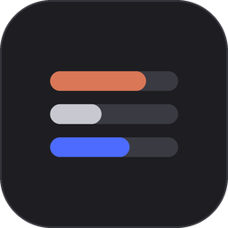
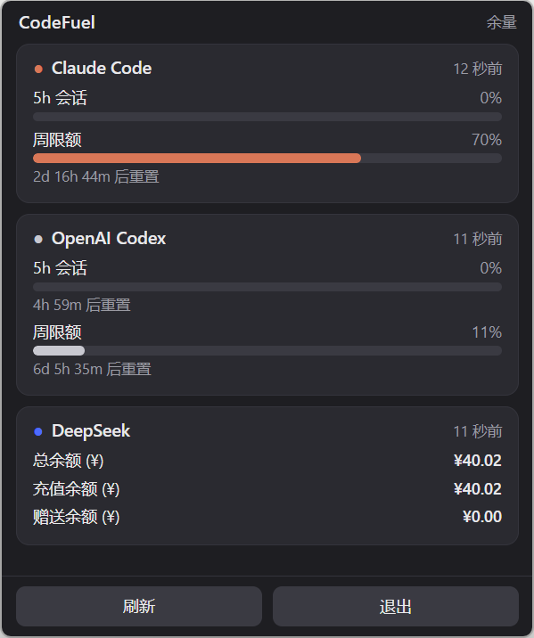

# CodeFuel

<p align="center"></p>

[English](README.md) | **简体中文**

一个轻量的 Windows 系统托盘挂件，把你的 AI 编程"油表"常驻在眼前 —— 包括
**Claude Code** 和 **OpenAI Codex** 的剩余用量限额，以及 **DeepSeek** 的账户
余额 —— 让你不会在任务中途突然"没油"。

Claude 和 Codex 直接复用它们的 CLI 已经存在本地的登录凭证，无需手动填 API
key；DeepSeek 则使用你自己提供的余额查询 key。

<p align="center"></p>

## 显示什么

- **托盘图标** —— 两条横向条：上 = Claude（橙色），下 = Codex（灰色）。每条
  跟踪该 provider 用得最多的那个限额，超过 90% 变红，provider 出错时以斜纹
  变暗。
- **悬停面板** —— 深色弹窗，每个 provider 一张卡片：
  - Claude / Codex：每个限额窗口（5 小时会话、周限额等）显示进度条、百分比和
    重置倒计时。
  - DeepSeek：以纯文本显示账户余额 —— 总余额、充值余额、赠送余额 —— 按币种
    分行。不画进度条（余额没有自然上限），也不上托盘图标。

  鼠标移到图标上面板自动弹出，离开图标和面板后自动隐藏；左键点击也能打开（兜底
  方式）。
- **右键菜单** —— 立即刷新 · 开机自启（默认关）· 退出。

数据仅按需获取 —— 启动时、打开面板时（有节流）、手动刷新时 —— 因此不会频繁
打到有限流的用量接口上。

## 环境要求

- Windows 10/11（64 位），需 **WebView2 运行时**（Windows 11 通常已预装；否则
  安装微软的 Evergreen WebView2 运行时）。
- 看 Claude / Codex 卡片：需已登录的 Claude Code（`~/.claude/.credentials.json`）
  和/或 Codex（`~/.codex/auth.json`）。某个凭证缺失或过期时，对应卡片显示修复
  提示，其他 provider 照常工作。
- 看 DeepSeek 卡片：需一个 DeepSeek API key（见 [配置](#配置)）。
- Python 3.11+ —— 仅在从源码运行或自行打包 EXE 时需要。

## 安装

从 [Releases](../../releases) 页面下载 `CodeFuel.exe` 直接运行 —— 单文件、免
安装。

或从源码运行：

```powershell
python -m pip install -r requirements.txt

# 在终端打印当前用量（数据层冒烟测试）：
python -m codefuel --cli

# 启动托盘应用：
python -m codefuel
```

## 配置

首次运行会在 `%APPDATA%\CodeFuel\config.json` 生成配置文件：

```json
{
  "min_fetch_gap_seconds": 60,
  "providers": { "claude": true, "codex": true, "deepseek": true },
  "deepseek_api_key": "",
  "log_level": "INFO",
  "panel_linger_seconds": 2.0,
  "request_timeout_seconds": 10,
  "panel_width": 400
}
```

- `min_fetch_gap_seconds` —— 打开面板时，同一 provider 在这么多秒内最多重新
  获取一次（手动刷新不受此限制）。
- `providers` —— 单独开关每张卡片。
- `deepseek_api_key` —— 你的 DeepSeek 余额 key。留空则回退到环境变量
  `DEEPSEEK_API_KEY`。没有 key 时 DeepSeek 卡片显示提示，不影响其他 provider。
- `log_level` —— `DEBUG` / `INFO` / `WARNING` / `ERROR`。环境变量
  `CODEFUEL_DEBUG` 仍会无视此值强制 `DEBUG`。
- `panel_linger_seconds` —— 鼠标离开图标和面板后，面板再停留多少秒才隐藏。
- `request_timeout_seconds` —— 各 provider 调用接口的 HTTP 超时秒数。
- `panel_width` —— 面板窗口宽度（CSS 像素，高度按内容自适应）。

改动在下次启动时生效（配置在启动时读取一次）。

日志与配置同目录：`%APPDATA%\CodeFuel\codefuel.log`（滚动，1 MB × 3）。凭证
和 token 从不写入日志。命名互斥量防止启动第二个实例。

## 工作原理

```
providers/ --fetch()--> poller（守护线程）--写入--> state（带锁缓存）
  claude.py                                          |
  codex.py                              tray (pystray)   panel (pywebview)
  deepseek.py
```

- **providers/** 读取本地凭证（或 API key）并调用各工具的用量接口。`fetch()`
  从不抛异常 —— 失败时返回一个 `error` 字段带可读修复提示的快照。
  - **Claude** —— `GET https://api.anthropic.com/api/oauth/usage`
    (`anthropic-beta: oauth-2025-04-20`)。遇到 401 时用本地 `refreshToken` 做
    一次标准 OAuth 刷新；刷新得到的 token **只保存在内存**，绝不写回你的凭证
    文件。
  - **Codex** —— `GET https://chatgpt.com/backend-api/wham/usage`
    (`Authorization: Bearer`、`ChatGPT-Account-Id`)。
  - **DeepSeek** —— `GET https://api.deepseek.com/user/balance`
    (`Authorization: Bearer`)。
- **poller** 仅按需获取（无周期轮询）：启动时一次、打开面板时（按
  `min_fetch_gap_seconds` 节流）、手动刷新时。一个 provider 失败不会阻塞其他。
- **state** 是线程安全的快照缓存，UI 只读取它。

## 打包单文件 EXE

```powershell
python -m pip install pyinstaller
python -m PyInstaller --noconfirm CodeFuel.spec
# -> dist\CodeFuel.exe
```

`.spec` 会把 `panel.html` 作为数据打包，产出一个无控制台窗口的单文件可执行
程序。"开机自启"在打包后指向该 EXE，从源码运行时则指向 `pythonw -m codefuel`。

## 测试

```powershell
python -m pytest -q
```

覆盖每个 provider（用抓取的 fixture 解析真实响应、凭证缺失、401 + 刷新、限流、
超时、字段变化）、数据模型、poller（按需获取、节流、失败隔离）和配置加载。

## 许可证

[MIT](LICENSE) © 2026 makeup1122
